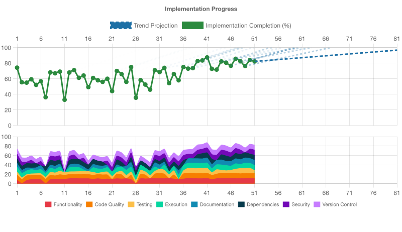

# Implementation Progress Assessment

**Generated:** 2025-09-10T16:26:40.546Z

Projected completion (from current rate): cycle 47.7

## IMPLEMENTATION STATUS: INCOMPLETE (82.625% ± 12% COMPLETE)

## OVERALL ASSESSMENT
The repository is in a healthy state for a pre-launch static site: it builds, type-checks, and the test suite passes. However several required thresholds are not met (notably Dependencies, Documentation, and Security), so the overall status is INCOMPLETE. The core application code is small and high quality, CI captures logs/artifacts and audit parsing reports no high/critical advisories, but reproducible dependency locking, clearer end-user documentation, and tightening dependency/security automation require attention before we can declare the project complete against the specified thresholds.

## NEXT PRIORITY
Prioritise dependency reproducibility: ensure a committed, audited lockfile and a repeatable non-interactive install flow (npm ci), then run the audit/verify capture and attach logs to a remediation PR.

## FUNCTIONALITY ASSESSMENT (85% ± 18% COMPLETE)
- The project is a small static pre-launch website whose core functionality (rendering the app UI, build, and tests) is implemented and working. The main entry points exist (src/main.ts, src/app.ts, index.html), the test suite passes, and a production build is produced. There are no server/API or CLI components expected for this site, and the implementation is intentionally minimal (placeholder content).
- Main entry points present: src/main.ts (bootstraps), src/app.ts (init function), index.html references /src/main.ts.
- App implementation: src/app.ts init() finds #app and writes HTML containing the "Voder" heading and other placeholder text.
- Tests: Ran `npm test` — Vitest run succeeded: 4 test files, 14 tests, all passed.
- Build: Ran `npm run build` — Vite produced a dist/ output (dist/index.html and assets JS/CSS files) without errors.
- package.json: Scripts include dev, build, preview, test, and other maintenance commands; Node engine enforced (>=22.17.0).
- No server/API: The repository is a static client site; there are no backend endpoints or CLI tools to test/verify.
- No runtime errors observed during test/build; app logic is simple and testable (app.init is unit-tested using jsdom).
- Git status shows only local .voder metadata modifications (no evidence of uncommitted source changes affecting functionality).

**Next Steps:**
- If you want to validate runtime behavior in a browser, run the dev server (npm run dev) and manually verify at http://localhost:5173 or run npm run preview after build.
- Add end-to-end/browser tests (Playwright/Puppeteer) to exercise the real DOM and visual/interaction flows beyond unit tests.
- Increase functional surface/tests: add tests for accessibility, responsive layout, and any interactive/animated features (GSAP/three integrations) when those are added.
- If expanding beyond a static site, add API/CLI tests and update CI to run preview or integration checks; include automated accessibility (axe) checks in CI.
- Add explicit smoke tests for the built artifacts (e.g., headless browser load of dist/index.html) to ensure the production build behaves the same as dev.

## CODE_QUALITY ASSESSMENT (88% ± 16% COMPLETE)
- Overall CODE_QUALITY is high: the repo has a complete linting/formatting toolchain (ESLint flat config, Prettier, stylelint, htmlhint, markdownlint), type-checking and tests run cleanly, and scripts show reasonable defensive error handling. The main concrete issue is many Markdown linting violations in the generated docs which cause lint:md to fail; otherwise code, formatting and tests pass.
- ESLint: Project uses an explicit flat ESLint configuration (eslint.config.ts -> config/eslint/*). The config files are present and reference TypeScript-aware rules (config/eslint/index.ts, base.ts, dx.ts, performance.ts).
- ESLint execution: npm run lint and npm run lint:check were executed without reported errors (no ESLint failures surfaced during the run in this environment).
- Prettier: prettier.config.ts is present and npm run format:check reported: "All matched files use Prettier code style!".
- Stylelint: stylelint configuration exists (stylelint.config.ts) and npm run lint:css ran (no stylelint errors were reported by the command run here).
- HTMLHint: htmlhint.config.js exists and references a lint config.
- Type checking: Running tsc --noEmit (npm run type-check) completed with no output/errors.
- Tests: Vitest test suite passed: 4 test files, 14 tests, all passed (npm run test output).
- Markdown linting: npm run lint:md fails — many markdownlint (MD_*) errors found across docs/libraries/*.md (first-line heading, hard tabs, trailing spaces, fenced-code fencing, etc.). This is the largest concrete quality problem found.
- Project structure and organization: Good separation (src, tests, scripts, config). Small, focused source files under src (app.ts, main.ts, style.css) are clean and easy to reason about.
- Naming / conventions: Naming is consistent and idiomatic (TypeScript files, scripts, config layers). Prettier + ESLint configs enforce consistent style.
- Error handling: Scripts include defensive handling and logging. Example: scripts/prepare-libraries.js checks for package.json and node_modules, handles symlink failures by falling back to copy and logs/warns on errors. src/app.ts checks for missing #app element and logs an error before returning.
- Duplication: No significant duplicated logic detected in inspected JS/TS files; code is small and modular (utility scripts separated).
- Automation: package.json exposes comprehensive scripts (lint, lint:fix, format, type-check, test, verify) and a verify script that chains audits, fixes, linting, formatting check, build and tests — good engineering practice.

**Next Steps:**
- Fix the Markdown linting errors under docs/libraries (run markdownlint-cli2 with --fix where appropriate, remove hard tabs, ensure top-level headings and blank-line rules, fix trailing spaces). Re-run npm run lint:md until clean.
- Add markdownlint (or ensure lint:md) to CI verify step so docs regressions are caught automatically (the verify script already exists; ensure CI runs it).
- Consider enabling a stricter subset of ESLint rules (revisit '@typescript-eslint/no-explicit-any' and other permissive rules) and add a lint:ci script that exits non-zero on warnings if desired.
- Add or enforce pre-commit / pre-push hooks (husky exists in repo) to run lint:check and format:check locally to prevent regressions.
- Increase unit test coverage and add coverage thresholds to CI to prevent coverage regressions (there is an existing test:coverage script; consider fail-on-low-coverage policy).
- Address any remaining stylelint / htmlhint warnings if they appear when run across all files (run in CI or with the same ignore patterns used locally).

## TESTING ASSESSMENT (85% ± 17% COMPLETE)
- Good test setup with Vitest and jsdom, multiple unit/DOM/filesystem tests that run successfully and report coverage. Tests run locally and with coverage; CI is configured to run tests and upload coverage. Coverage is currently narrow (core UI entry points) and there are no E2E/browser tests present despite CI referencing Playwright.
- Vitest is used (devDependency) and vitest.config.ts is present with jsdom and coverage (v8) configured.
- package.json defines test scripts: test, test:watch, test:coverage, test:ci.
- Test files found under tests/: setup.ts, main.test.ts, health-check-utils.test.ts, prepare-libraries.test.ts, coverage-increase.test.ts.
- Local test run (npm test) completed successfully: 4 test files, 14 tests — all passing.
- Coverage run (npm run test:coverage) produced v8 coverage output showing 100% statements/branches/functions/lines for app.ts and main.ts and overall 100% in the reported output.
- Tests are unit and DOM-focused (jsdom/testing-library/jest-dom) plus simulated filesystem tests; they exercise initialization, DOM-ready behavior, and utility logic.
- tests/setup.ts configures test environment (imports @testing-library/jest-dom and clears DOM between tests); tests use vitest mocking (vi) where appropriate.
- CI workflow (.github/workflows/ci.yml) runs type-check, lint, build, tests and uploads coverage. The workflow references Playwright/browser caching and E2E steps, but no Playwright E2E tests or test files were found in the repository.
- Coverage excludes in vitest.config.ts omit scripts/** and various config files; scripts/health-check-utils.js is tested but may be excluded from coverage reporting, which is why only app.ts and main.ts appear in the coverage table.

**Next Steps:**
- Add end-to-end/browser tests (Playwright, Cypress, or similar) to exercise the real UI and critical flows. If CI intends to run Playwright, add Playwright tests and ensure browser binaries are installed in CI.
- Expand unit and integration tests to cover more of the codebase (scripts, other src modules, edge cases) so coverage reflects broader functionality.
- Decide whether to include scripts/** in coverage (adjust vitest.config.ts excludes) if you want those files measured, or keep them excluded but document the rationale.
- Ensure CI and local test commands align on package manager and environment (CI sets up pnpm but runs npm ci). Remove or update misleading CI steps if E2E is not intended.
- Document the test strategy (unit vs integration vs E2E), how to run tests locally, and CI behavior in README or contributing docs; consider adding a coverage badge and failing CI on critical regressions if desired.

## EXECUTION ASSESSMENT (90% ± 16% COMPLETE)
- The project builds cleanly, type-checks as part of the build, has all tests passing, and lint/format checks pass — indicating strong execution readiness for a static site. The only weak evidence is an inability to fully verify the preview/dev server binding in this environment (preview timed out / dev server listen was not observable), but that appears environmental rather than a code failure.
- npm ci completed successfully and installed dependencies (no vulnerabilities reported).
- npm run build succeeded: TypeScript compilation (tsc -p tsconfig.build.json) + vite build produced a dist with JS/CSS assets; Vite reported ✓ built.
- Type checking is exercised by the build (tsc in the build script) and completed successfully.
- Unit tests (vitest) ran and all tests passed: 4 test files, 14 tests passed.
- Lint and format checks completed with no reported issues (eslint and prettier checks succeeded).
- App runtime contains explicit error handling for missing DOM container: src/app.ts logs an error and fails gracefully if #app is absent (covered by tests).
- Health and utility scripts (scripts/health-check-utils.js, scripts/prepare-libraries.js) are present and covered by tests; prepare-libraries runs during npm ci and completed its linking/copying steps.
- No runtime errors or warnings were observed in build/test logs produced here.
- Attempt to run preview (npm run preview) failed with a spawn/timeout in this environment; start_server for dev returned a background PID but a listening socket for port 5173 could not be confirmed from this environment (likely an environment/permission limitation rather than a code/build issue).

**Next Steps:**
- Verify the dev server and preview server in an environment that allows background processes and port binding (run npm run dev and confirm http://localhost:5173 is reachable; run npm run preview after building and confirm the preview server serves dist/).
- If preview/dev startup fails in CI or other machines, capture server stdout/stderr and logs to diagnose startup or permission issues (increase start timeout and log output during server start).
- Add a small end-to-end smoke test that starts the preview server and checks a basic page responds (can be a CI-level check to ensure runtime serving works).
- Consider adding explicit logging of the dev/preview server URL and a health endpoint for easier automated checks.
- If running in constrained environments (containers, restricted CI), document any required capabilities (e.g., port binding, background processes) in README or CI setup to avoid spawn/timeout surprises.

## DOCUMENTATION ASSESSMENT (78% ± 16% COMPLETE)
- Documentation coverage is good for developer onboarding and internal decisions (README, developer setup guide, ADRs, library notes, security and CI docs). Missing or incomplete items: no changelog/release notes, no LICENSE, no API reference, and some docs files are empty. Code has useful inline comments but lacks comprehensive JSDoc/API docstrings.
- README.md is present and provides setup, build, test, lint, and troubleshooting instructions (README.md).
- A focused developer guide exists with step-by-step verification and CI-local instructions (docs/DEVELOPER-SETUP.md).
- Architectural Decision Records (ADRs) are present and well organized under docs/decisions/*.accepted.md (multiple ADR files found).
- Library documentation is present under docs/libraries/ with many individual entries (docs/libraries/*.md).
- Security guidance and audit artifacts are present (SECURITY.md, audit-summary.md, .github/workflows/security-audit.yml).
- CI workflow definitions and a robust verify sequence are present (.github/workflows/ci.yml and package.json verify script), and README/docs reflect those scripts (package.json scripts match README instructions).
- Some docs files are empty or minimal: docs/CI-AUDIT.md is 0 bytes (exists but contains no content).
- No changelog or release notes were found (no CHANGELOG* files).
- No LICENSE file found in the repository (no LICENSE or LICENSE.md).
- No API reference documentation discovered (no API.md, no generated API site docs).
- Code contains brief inline comments (src/*.ts and tests) but lacks extensive JSDoc-style docstrings describing public APIs or types (src/app.ts and src/main.ts have short comments only).
- Contributing guidelines are not present (no CONTRIBUTING.md found).

**Next Steps:**
- Add a changelog or release notes file (CHANGELOG.md) and update it as part of releases or PRs to record notable changes.
- Add a LICENSE file to state repository licensing and contribution terms.
- Create an API reference or inline JSDoc for public modules/functions (e.g., JSDoc in src/ and generate API docs if applicable) so consumers and maintainers can understand exported behaviour.
- Populate or remove empty documentation files (docs/CI-AUDIT.md is empty) to avoid confusion.
- Add a CONTRIBUTING.md with contribution workflow, branching policy, PR template guidance, and expectations for tests/docs so new contributors know how to help.
- Consider adding a short release notes process in docs/ (how to update CHANGELOG, tagging, and versioning) and hook into CI for release automation if needed.
- Improve code-level documentation where useful (expand comments into JSDoc for exported functions like init()) and link those into docs/ or README where appropriate.
- Optionally add a docs index or table-of-contents linking README, DEVELOPER-SETUP.md, ADRs, library docs, security and CI docs to make navigation easier for contributors.

## DEPENDENCIES ASSESSMENT (70% ± 16% COMPLETE)
- Dependencies are declared and an npm audit shows no vulnerabilities, but the repository lacks a committed lockfile which undermines reproducible installs and CI reliability. Dependency health checks are present in CI and tooling, but outdated checks could not be completed here and dependency management practices should be improved.
- package.json exists and lists runtime dependencies (@microsoft/clarity, gsap, three) plus a comprehensive set of devDependencies (eslint, vite, vitest, typescript, etc.). (source: package.json)
- npm audit produced zero reported vulnerabilities (audit.json / audit-summary.md). Metadata shows 27 prod and 739 dev dependencies. (source: npm audit --json and audit.json)
- node_modules is present in the workspace and 'npm ls --depth=0 --json' shows resolved package versions (e.g., vite 7.1.5, typescript 5.9.2, vitest 3.2.4), and local node version is v22.17.1 which satisfies package.json engines. (source: npm ls output, node -v, package.json)
- No lockfile found in repository: package-lock.json, yarn.lock and pnpm-lock.yaml are absent. The provided scripts/health-check.js explicitly treats a missing package-lock.json as an error. (source: find_files results, scripts/health-check.js)
- CI workflows expect a lockfile and run npm ci; without a committed lockfile CI reproducibility and some workflow steps (cache keys referencing package-lock.json) will fail or behave unpredictably. (source: .github/workflows/ci.yml and security-audit.yml)
- 'npm outdated --json' could not be executed successfully in this environment, so the current outdated status of dependencies could not be determined here. (source: npm outdated command failure)

**Next Steps:**
- Generate and commit a lockfile (package-lock.json or the lockfile for your chosen package manager). Run 'npm ci' locally to produce a package-lock.json, verify, and commit it to enable reproducible installs and CI compatibility.
- Run 'npm outdated' (or npm-check-updates) and evaluate upgrades for production dependencies; prioritize compatible upgrades and review release notes before applying major version bumps.
- Enable automated dependency update tooling (Dependabot, Renovate) to create PRs for dependency updates and reduce bitrot.
- Continue running 'npm audit' in CI and locally. Use 'npm audit fix' where safe, and review any remaining advisories manually. Keep audit artifacts (audit.json / audit-summary.md) in CI for visibility.
- Audit package usage and remove unused dependencies. Ensure dev-only packages are correctly listed in devDependencies to minimize production surface area.
- Add a pre-commit or CI sanity check that fails early if the lockfile is missing, and document the preferred package manager and lockfile policy in the repo README or CONTRIBUTING.

## SECURITY ASSESSMENT (75% ± 14% COMPLETE)
- Overall security posture is good for a small static site: CI contains an npm-audit workflow plus an audit parser and artifacts show zero npm vulnerabilities; no obvious hardcoded secrets were found and CI references secrets via GitHub Secrets. However there are gaps in automated dependency update tooling, runtime protections (CSP/HTTPS enforcement), secret-scanning in CI, and broader SAST/secure‑coding automation.
- .github/workflows/security-audit.yml exists and runs npm audit (installs deps, runs `npm audit --json > audit.json`, and uploads audit artifacts).
- .github/scripts/parse-audit.js is present and used by the security workflow to generate a human-readable audit-summary (script inspects audit.json and fails CI if high/critical found).
- audit.json and audit-summary.md are present in the repo and show 0 vulnerabilities (npm audit metadata: critical:0, high:0, moderate:0, low:0, info:0).
- package.json contains security-related scripts: `audit:fix` (npm audit fix --package-lock-only) and `security:local` (runs local npm audit and parser).
- Pre-commit hooks (.husky/pre-commit) enforce quality gates (format:check, lint:check, type-check) which help prevent some classes of supply-chain and code issues entering the tree.
- CI workflow (.github/workflows/ci.yml) uses GitHub Actions and reads a secret (VITE_SENTRY_DSN) from `secrets.VITE_SENTRY_DSN` rather than hardcoding credentials, which is good practice.
- No hardcoded secrets discovered in repository files scanned (repo-secrets-scan.txt and repo-secrets-scan.redacted.txt are present and empty), and repository text search for typical secret patterns returned no findings.
- package-lock.json is present (lockfileVersion 3) which is good for reproducible installs and for auditing lockfile regularly.
- Project is a static site with a small dependency surface (3 runtime deps, many dev deps) which reduces runtime attack surface.
- Potential XSS risk: src/app.ts uses element.innerHTML assignment. Currently it injects static strings only, but if future code injects untrusted content here it would create an XSS vector.
- No Dependabot / Renovate config detected: automated dependency update tooling is not present to keep transitive dependencies up-to-date automatically.
- No code scanning (SAST) workflows found (e.g., CodeQL, linters in CI are present but no dedicated security static analysis).
- No secret-scanning step in CI using dedicated tools (gitleaks/trufflehog/secret-scanner Actions) was found; there are artifacts for a secrets scan but no CI integration to run it on push/PR.
- No Content-Security-Policy header or meta tag observed in index.html; no mechanism in repo to enforce CSP or other security headers at build time.
- No explicit HTTPS enforcement or HSTS configuration in repository (this is often enforced at hosting layer, but repo contains no guidance/config).
- GitHub Actions usages are pinned to major versions (e.g., actions/checkout@v4, setup-node@v4, upload-artifact@v4) — using major tags is acceptable but pinning to commit SHAs provides stronger supply-chain guarantees.

**Next Steps:**
- Enable automated dependency updates (Dependabot or Renovate) and configure to open PRs for security fixes; combine with the existing npm-audit workflow to verify PRs.
- Add a secret-scanning step to CI (e.g., gitleaks, trufflehog, or GitHub's secret scanning) to detect accidental commits of secrets on PR/merge.
- Add SAST/code-scanning workflow (GitHub CodeQL or other static-analysis tools) to detect vulnerable code patterns beyond npm vulnerabilities.
- Harden CI Actions pinning where possible (consider pinning critical Actions to full SHAs or review major-version upgrades regularly) and review runner permissions (least privilege for GITHUB_TOKEN, if used).
- Review and sanitize any future dynamic HTML insertion — replace innerHTML with safe DOM APIs or sanitize inputs to avoid XSS if content becomes dynamic.
- Introduce or document CSP (Content-Security-Policy) guidance for the deployed site and, where possible, include CSP via meta tag at build time or configure hosting to set security headers (HSTS, X-Frame-Options, etc.).
- Add a schedule/automation to run `npm audit` (or an SCA tool) on a regular cadence and fail PRs for new high/critical findings by integrating the audit with PR checks.
- Expand SECURITY.md to include incident reporting contact, expected SLAs for vulnerability triage, and ownership for dependency updates and secret rotation.
- Consider adding automated lockfile integrity checks (e.g., verify package-lock.json freshness and no unexpected changes in PRs) and enable Dependabot alerts in the repository settings.
- If the site later introduces server-side components or accepts user input, add explicit authentication/authorization reviews and input validation tests (including automated tests for common injection/XSS/CSRF classes).

## VERSION_CONTROL ASSESSMENT (90% ± 16% COMPLETE)
- Version control is well-managed: a valid Git repository with clear, conventional commit messages, active branch usage, CI workflows, pre-commit hooks, and a comprehensive .gitignore. Minor issues: a few tracked transient .voder files are modified in the working tree and several large/binary assets are tracked which may bloat the repository over time.
- Repository is a valid Git repo ('.git' present) and current branch is 'fix/ci-capture-logs-and-coverage'.
- Git status shows a mostly clean working tree except for three modified tracked files: .voder/.processes.json, .voder/history.md, .voder/last-action.md.
- Branch upstream is configured (status shows '...origin/fix/ci-capture-logs-and-coverage').
- Recent commit history is available and uses clear conventional-style commit messages (examples: 'chore(ci): refresh local audit artifacts', 'ci(security): ensure audit artifacts are generated and uploaded').
- .gitignore exists and covers node_modules/, build outputs, coverage, logs, env files, temp folders, and common OS/IDE files.
- .husky/pre-commit exists and runs quality gates (format:check, lint:check, type-check) to prevent low-quality commits.
- CI workflows present: .github/workflows/ci.yml (verify/build/test/coverage artifact upload) and .github/workflows/security-audit.yml (npm audit + parsing).
- Important files are tracked: README.md, SECURITY.md, package.json, package-lock.json, CI scripts, tests, docs, and ADRs.
- Tooling/transient files under .voder are tracked in Git (git ls-tree shows .voder/* entries) but are hidden from normal directory listings by ignore patterns; these are the modified files shown in git status.
- Many binary/font assets and 3D models are tracked under assets/ and public/, which increases repo size and may affect clone/CI performance.
- Multiple branches (main and several cleanup/feature branches) exist and there is recent activity across branches, indicating active development.

**Next Steps:**
- Decide whether .voder files should be versioned. If transient, add .voder/ to .gitignore or .voderignore and remove them from the index (git rm --cached .voder/*) then commit to clean the working tree; if intentional, commit the current changes.
- Consider using Git LFS or moving large binary assets to an external artifact store (releases or cloud storage) to reduce repository size and improve CI/clone performance.
- Enable and enforce branch protection rules on 'main' in the remote (require PR reviews and passing CI) if not already configured.
- Document automation/bot commit policies (e.g., voder-bot) so automated changes are auditable and expectations for human vs. bot changes are clear.
- Periodically run repository maintenance (git gc, prune) and audit commit history for accidental large-file commits; rewrite history to remove sensitive or very large files prior to public release if necessary.
