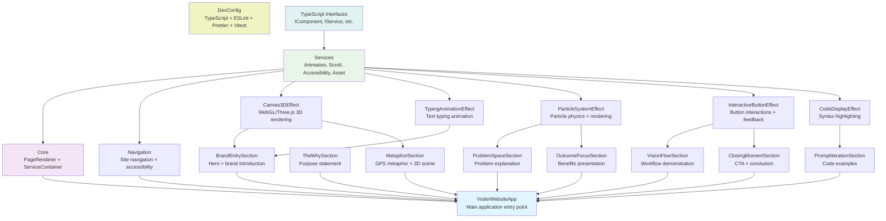

# Component Hierarchy for Voder Pre-Launch Website

This document outlines the component architecture for the Voder.ai pre-launch website. It shows what components exist, their dependencies, and what needs to be built next.

**Based on**: LLM-IMPLEMENTATION-PLAN.md and the hierarchical documentation system in `prompts/`

## 🏗️ Component Hierarchy

## � Component Responsibilities

### Application Layer
- **VoderWebsiteApp**: Main entry point, initializes and coordinates all components

### Infrastructure Layer  
- **Core**: PageRenderer (DOM coordination) + ServiceContainer (dependency injection)
- **Navigation**: Site navigation, keyboard access, ARIA support
- **Services**: AnimationService (GSAP), ScrollService (Intersection Observer), AccessibilityService (ARIA), AssetService (loading)
- **TypeScript Interfaces**: IComponent, IService, ISection, IEffect - shared contracts

### Website Sections (User Journey)
- **BrandEntrySection**: Hero section with brand introduction and 3D/typing effects
- **TheWhySection**: Purpose statement and mission explanation  
- **ProblemSpaceSection**: Problem space visualization with particle effects
- **MetaphorSection**: GPS metaphor explanation with 3D scene
- **VisionFlowSection**: Workflow demonstration with interactive elements
- **PromptIterationSection**: Code examples with syntax highlighting
- **OutcomeFocusSection**: Benefits and outcomes with particle emphasis
- **ClosingMomentSection**: Call-to-action and conclusion with interactive buttons

### Visual Effects (Reusable)
- **Canvas3DEffect**: WebGL/Three.js 3D rendering for brand + metaphor sections
- **TypingAnimationEffect**: Character-by-character text animation for brand section
- **ParticleSystemEffect**: Particle physics and rendering for problem + outcome sections  
- **InteractiveButtonEffect**: Button hover/click effects for flow + closing sections
- **CodeDisplayEffect**: Syntax highlighting and code presentation for code section

### Development Tools
- **DevConfig**: TypeScript configs, ESLint rules, Prettier, Vitest, Markdown linting

## � Component Descriptions

### Infrastructure Components

#### DevConfig
**Purpose**: Development tooling configuration for all packages
**Status**: ✅ Complete
**Provides**: TypeScript configs, ESLint rules, Prettier, Vitest, Markdown linting
**Dependencies**: None (all other components depend on this)

#### Shared  
**Purpose**: Common types and interfaces used across all components
**Status**: ✅ Complete
**Provides**: TypeScript interfaces and type definitions
**Dependencies**: DevConfig

#### Core
**Purpose**: Main application infrastructure (PageRenderer + ServiceContainer)
**Status**: ✅ Package exists, needs implementation
**Provides**: Application lifecycle, dependency injection, page coordination
**Dependencies**: Shared, Services

#### Services
**Purpose**: Core services (Animation, Scroll, Accessibility, Asset)
**Status**: ✅ Package exists, needs implementation  
**Provides**: Reusable services for animations, scroll detection, accessibility, asset loading
**Dependencies**: Shared

### Website Components  

#### Navigation
**Purpose**: Site navigation and accessibility
**Status**: 🚧 Package exists, needs implementation
**Dependencies**: Services (Accessibility), Shared

#### Section Components (8 total)
**Purpose**: Individual website sections (Brand Entry, The Why, Problem Space, etc.)
**Status**: 🚧 Packages exist, need implementation
**Dependencies**: Services (Animation, Scroll), Effects, Shared

#### Effect Components (5 total)  
**Purpose**: Reusable visual effects (3D Canvas, Typing Animation, Particles, etc.)
**Status**: 🚧 Packages exist, need implementation
**Dependencies**: Services (Animation, Asset), Shared

## � Implementation Alignment

## 🎯 Implementation Order

**Build in dependency order:**

1. **DevConfig** ✅ (Complete - provides tooling for all others)
2. **TypeScript Interfaces** 🚧 (Foundation contracts - no dependencies)  
3. **Services** 🚧 (Core functionality - depends on interfaces)
4. **Core** 🚧 (App infrastructure - depends on services + interfaces)
5. **Navigation** 🚧 (Site nav - depends on services + interfaces)
6. **Effects** 🚧 (Visual components - depends on services + interfaces)
7. **Sections** 🚧 (Website content - depends on services + effects + interfaces)
8. **VoderWebsiteApp** 🚧 (Main app - depends on everything)

**Next to implement**: TypeScript Interfaces (shared contracts that everything else needs)
