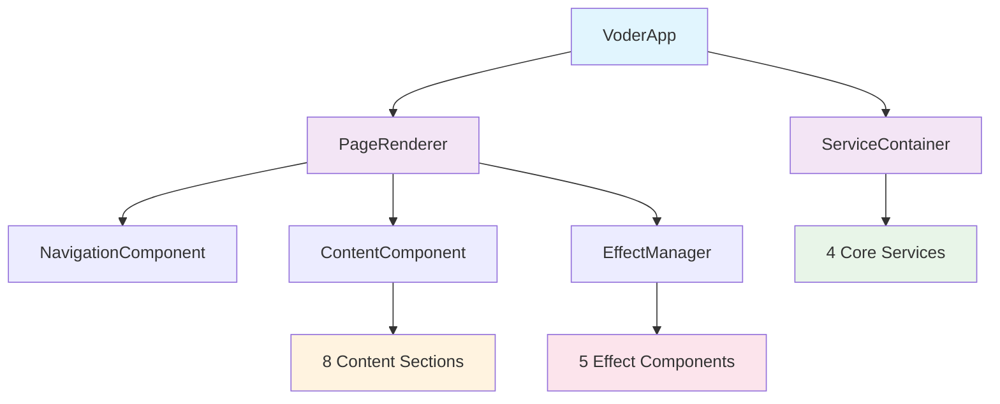
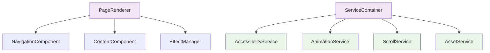
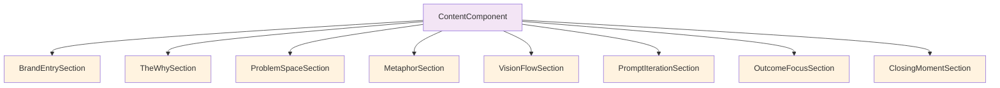
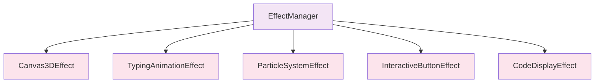
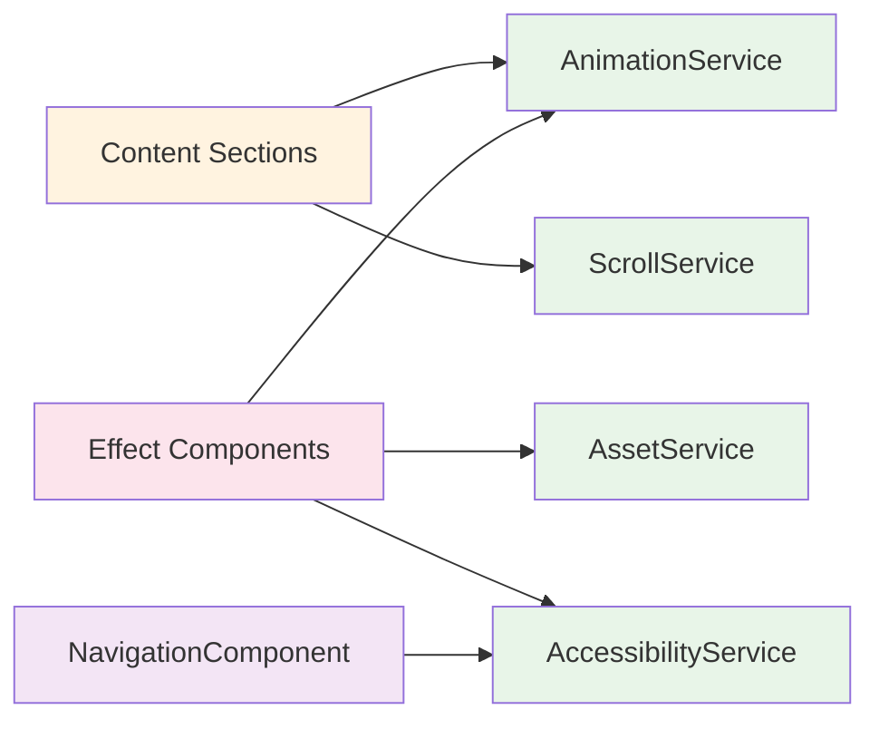
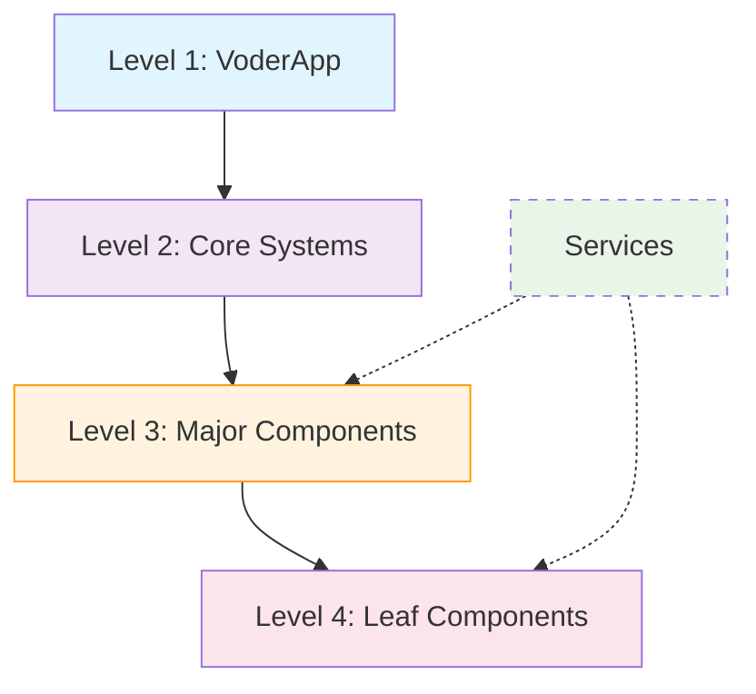
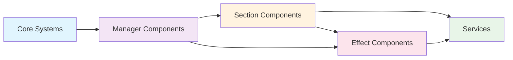

# Component Hierarchy for Voder Pre-Launch Website

This document outlines the component architecture for the Voder.ai pre-launch website based on the specifications in `/prompts/voder-website.md`. The hierarchy follows principles of single responsibility, encapsulation, composability, replaceability, independent deployability, and cohesive interfaces.

## 🏗️ Component Hierarchy Overview

### High-Level Architecture

### Level 2: Core Systems Detail

### Level 3: Content Sections

### Level 3: Effect Components

### Service Dependencies

## 📱 Level 1: Application Layer

### VoderApp
**Responsibility**: Application lifecycle and coordination only
**Interface**: 
- Input: Configuration object
- Output: void (initializes entire app)
**Dependencies**: PageRenderer, ServiceContainer (via constructor injection)
**Characteristics**:
- **Single Responsibility**: ✅ Only coordinates app initialization and lifecycle
- **Encapsulated**: ✅ Hides app startup complexity from outside
- **Composable**: ✅ Uses dependency injection for core systems
- **Replaceable**: ✅ Standard app architecture, could swap frameworks
- **Independent**: ✅ Can be deployed independently (depends on abstractions)
- **Cohesive Interface**: ✅ Config in, running app out

## 🎨 Level 2: Core Systems

### PageRenderer
**Responsibility**: Page layout and rendering coordination only
**Interface**:
- Input: Page configuration object
- Output: void (renders page to DOM)
**Dependencies**: NavigationComponent, ContentComponent, EffectManager (via constructor)
**Characteristics**:
- **Single Responsibility**: ✅ Only coordinates page-level rendering
- **Encapsulated**: ✅ Hides DOM manipulation details
- **Composable**: ✅ Composes major page components
- **Replaceable**: ✅ Standard renderer interface
- **Independent**: ✅ Can swap rendering strategy independently
- **Cohesive Interface**: ✅ Page config in, rendered page out

### ServiceContainer
**Responsibility**: Service instance management and injection only
**Interface**:
- Input: Service requests
- Output: Service instances
**Dependencies**: AccessibilityService, AnimationService, ScrollService, AssetService (registers these)
**Characteristics**:
- **Single Responsibility**: ✅ Only manages service lifecycle and injection
- **Encapsulated**: ✅ Hides service creation and wiring
- **Composable**: ✅ Standard dependency injection container
- **Replaceable**: ✅ Could swap DI frameworks
- **Independent**: ✅ Service registration is configurable
- **Cohesive Interface**: ✅ Service requests in, instances out

## 🧭 Level 3: Major Components

### NavigationComponent
**Responsibility**: Navigation UI and behavior only
**Interface**:
- Input: Navigation configuration, accessibility service
- Output: Navigation DOM element with behavior
**Dependencies**: AccessibilityService (via injection)
**Characteristics**:
- **Single Responsibility**: ✅ Only handles navigation UI and focus management
- **Encapsulated**: ✅ Hides keyboard navigation and ARIA implementation
- **Composable**: ✅ Uses injected services, standard component interface
- **Replaceable**: ✅ Could swap navigation implementations
- **Independent**: ✅ Only depends on service abstractions
- **Cohesive Interface**: ✅ Nav config + services in, interactive nav out

### ContentComponent
**Responsibility**: Content layout and section coordination only
**Interface**:
- Input: Content configuration, section components array
- Output: Content DOM element with all sections
**Dependencies**: All section components (BrandEntrySection, TheWhySection, etc.)
**Characteristics**:
- **Single Responsibility**: ✅ Only coordinates content sections layout
- **Encapsulated**: ✅ Hides section arrangement and responsive logic
- **Composable**: ✅ Composes multiple section components
- **Replaceable**: ✅ Could swap content layout strategies
- **Independent**: ✅ Depends only on section component interfaces
- **Cohesive Interface**: ✅ Content config + sections in, arranged content out

### EffectManager
**Responsibility**: Visual effect coordination and timing only
**Interface**:
- Input: Effect configuration, scroll events
- Output: void (coordinates effect triggers)
**Dependencies**: All effect components (Canvas3DEffect, TypingAnimationEffect, etc.)
**Characteristics**:
- **Single Responsibility**: ✅ Only coordinates when and how effects trigger
- **Encapsulated**: ✅ Hides effect timing and scroll threshold logic
- **Composable**: ✅ Composes multiple effect components
- **Replaceable**: ✅ Could swap effect orchestration strategies
- **Independent**: ✅ Depends only on effect component interfaces
- **Cohesive Interface**: ✅ Effect config + scroll events in, coordinated effects out

## 🎨 Level 4: Content Section Components

### BrandEntrySection
**Responsibility**: Brand introduction content and animations only
**Interface**:
- Input: Brand data, animation service, effect components
- Output: Brand section DOM element with interactive behavior
**Dependencies**: AnimationService, Canvas3DEffect, TypingAnimationEffect (via injection)
**Characteristics**:
- **Single Responsibility**: ✅ Only handles brand introduction narrative
- **Encapsulated**: ✅ Hides brand storytelling implementation details
- **Composable**: ✅ Uses injected services and effects
- **Replaceable**: ✅ Could swap brand presentation approaches
- **Independent**: ✅ Only depends on service/effect abstractions
- **Cohesive Interface**: ✅ Brand data + services in, brand section out

### TheWhySection
**Responsibility**: Purpose statement content and presentation only
**Interface**:
- Input: Purpose data, animation service
- Output: Purpose section DOM element with animations
**Dependencies**: AnimationService, TypingAnimationEffect (via injection)
**Characteristics**:
- **Single Responsibility**: ✅ Only handles purpose narrative presentation
- **Encapsulated**: ✅ Hides purpose storytelling implementation
- **Composable**: ✅ Uses injected animation services
- **Replaceable**: ✅ Could swap purpose presentation styles
- **Independent**: ✅ Only depends on service abstractions
- **Cohesive Interface**: ✅ Purpose data + services in, purpose section out

### ProblemSpaceSection
**Responsibility**: Problem explanation content and visualization only
**Interface**:
- Input: Problem data, animation service, particle effects
- Output: Problem section DOM element with visualizations
**Dependencies**: AnimationService, ParticleSystemEffect (via injection)
**Characteristics**:
- **Single Responsibility**: ✅ Only handles problem space explanation
- **Encapsulated**: ✅ Hides problem visualization complexity
- **Composable**: ✅ Uses injected services and effects
- **Replaceable**: ✅ Could swap problem presentation methods
- **Independent**: ✅ Only depends on service/effect abstractions
- **Cohesive Interface**: ✅ Problem data + services in, problem section out

### MetaphorSection
**Responsibility**: GPS metaphor content and 3D visualization only
**Interface**:
- Input: Metaphor data, 3D service, scroll service
- Output: Metaphor section DOM element with 3D scene
**Dependencies**: AnimationService, ScrollService, Canvas3DEffect (via injection)
**Characteristics**:
- **Single Responsibility**: ✅ Only handles GPS metaphor presentation
- **Encapsulated**: ✅ Hides 3D scene complexity and scroll coordination
- **Composable**: ✅ Uses injected services and 3D effects
- **Replaceable**: ✅ Could swap metaphor visualization approaches
- **Independent**: ✅ Only depends on service/effect abstractions
- **Cohesive Interface**: ✅ Metaphor data + services in, metaphor section out

### VisionFlowSection
**Responsibility**: Workflow visualization content and interactions only
**Interface**:
- Input: Workflow data, animation service, interactive components
- Output: Workflow section DOM element with interactive flow
**Dependencies**: AnimationService, InteractiveButtonEffect (via injection)
**Characteristics**:
- **Single Responsibility**: ✅ Only handles workflow demonstration
- **Encapsulated**: ✅ Hides workflow interaction complexity
- **Composable**: ✅ Uses injected services and interactive effects
- **Replaceable**: ✅ Could swap workflow presentation methods
- **Independent**: ✅ Only depends on service/effect abstractions
- **Cohesive Interface**: ✅ Workflow data + services in, workflow section out

### PromptIterationSection
**Responsibility**: Code demonstration content and display only
**Interface**:
- Input: Demo data, animation service, code display components
- Output: Demo section DOM element with code visualization
**Dependencies**: AnimationService, CodeDisplayEffect, TypingAnimationEffect (via injection)
**Characteristics**:
- **Single Responsibility**: ✅ Only handles code demonstration narrative
- **Encapsulated**: ✅ Hides code presentation and syntax highlighting
- **Composable**: ✅ Uses injected services and display effects
- **Replaceable**: ✅ Could swap code presentation approaches
- **Independent**: ✅ Only depends on service/effect abstractions
- **Cohesive Interface**: ✅ Demo data + services in, demo section out

### OutcomeFocusSection
**Responsibility**: Benefit presentation content and emphasis only
**Interface**:
- Input: Benefit data, animation service, emphasis effects
- Output: Outcome section DOM element with benefit highlights
**Dependencies**: AnimationService, ParticleSystemEffect (via injection)
**Characteristics**:
- **Single Responsibility**: ✅ Only handles benefit/outcome presentation
- **Encapsulated**: ✅ Hides benefit emphasis and highlight logic
- **Composable**: ✅ Uses injected services and emphasis effects
- **Replaceable**: ✅ Could swap benefit presentation styles
- **Independent**: ✅ Only depends on service/effect abstractions
- **Cohesive Interface**: ✅ Benefit data + services in, outcome section out

### ClosingMomentSection
**Responsibility**: Conclusion content and call-to-action only
**Interface**:
- Input: Closing data, animation service, interactive components
- Output: Closing section DOM element with final CTA
**Dependencies**: AnimationService, InteractiveButtonEffect (via injection)
**Characteristics**:
- **Single Responsibility**: ✅ Only handles conclusion and final call-to-action
- **Encapsulated**: ✅ Hides CTA presentation and interaction logic
- **Composable**: ✅ Uses injected services and interactive effects
- **Replaceable**: ✅ Could swap conclusion presentation approaches
- **Independent**: ✅ Only depends on service/effect abstractions
- **Cohesive Interface**: ✅ Closing data + services in, closing section out

## 🎭 Level 4: Effect Components

### Canvas3DEffect
**Responsibility**: 3D scene rendering and WebGL management only
**Interface**:
- Input: Scene configuration, asset service
- Output: Canvas DOM element with rendered 3D scene
**Dependencies**: AssetService (for 3D models), AnimationService (for 3D animations)
**Characteristics**:
- **Single Responsibility**: ✅ Only handles 3D scene rendering and WebGL
- **Encapsulated**: ✅ Hides Three.js complexity and WebGL details
- **Composable**: ✅ Uses injected services for assets and animation
- **Replaceable**: ✅ Could swap 3D rendering engines (Three.js → Babylon.js)
- **Independent**: ✅ Only depends on service abstractions
- **Cohesive Interface**: ✅ Scene config + services in, 3D canvas out

### TypingAnimationEffect
**Responsibility**: Text typing animation rendering only
**Interface**:
- Input: Text configuration, animation timing
- Output: DOM element with typing animation behavior
**Dependencies**: AnimationService (for timing control)
**Characteristics**:
- **Single Responsibility**: ✅ Only handles text typing animation effects
- **Encapsulated**: ✅ Hides character-by-character animation logic
- **Composable**: ✅ Uses injected animation service for timing
- **Replaceable**: ✅ Could swap typing animation implementations
- **Independent**: ✅ Only depends on animation service abstraction
- **Cohesive Interface**: ✅ Text config + timing in, typing element out

### ParticleSystemEffect
**Responsibility**: Particle effect rendering and physics only
**Interface**:
- Input: Particle configuration, animation service
- Output: DOM element with particle system
**Dependencies**: AnimationService (for particle movement)
**Characteristics**:
- **Single Responsibility**: ✅ Only handles particle physics and rendering
- **Encapsulated**: ✅ Hides particle calculations and Canvas API usage
- **Composable**: ✅ Uses injected animation service
- **Replaceable**: ✅ Could swap particle engines or move to WebGL
- **Independent**: ✅ Only depends on animation service abstraction
- **Cohesive Interface**: ✅ Particle config + animation in, particle element out

### InteractiveButtonEffect
**Responsibility**: Button interaction effects and feedback only
**Interface**:
- Input: Button configuration, accessibility service
- Output: Button DOM element with interaction effects
**Dependencies**: AccessibilityService (for ARIA), AnimationService (for hover effects)
**Characteristics**:
- **Single Responsibility**: ✅ Only handles button interaction effects
- **Encapsulated**: ✅ Hides hover, focus, and click effect implementations
- **Composable**: ✅ Uses injected services for accessibility and animation
- **Replaceable**: ✅ Could swap button interaction approaches
- **Independent**: ✅ Only depends on service abstractions
- **Cohesive Interface**: ✅ Button config + services in, interactive button out

### CodeDisplayEffect
**Responsibility**: Code syntax highlighting and display only
**Interface**:
- Input: Code configuration, asset service
- Output: DOM element with syntax-highlighted code
**Dependencies**: AssetService (for syntax highlighting themes)
**Characteristics**:
- **Single Responsibility**: ✅ Only handles code display and syntax highlighting
- **Encapsulated**: ✅ Hides syntax parsing and highlighting algorithms
- **Composable**: ✅ Uses injected asset service for themes
- **Replaceable**: ✅ Could swap syntax highlighting libraries
- **Independent**: ✅ Only depends on asset service abstraction
- **Cohesive Interface**: ✅ Code config + assets in, highlighted code out

## 🛠️ Level 3: Service Components

### AccessibilityService
**Responsibility**: ARIA management and screen reader support only
**Interface**:
- Input: ARIA command objects (set label, announce, etc.)
- Output: Promise<void> (ARIA state updated)
**Dependencies**: None (uses browser DOM API)
**Characteristics**:
- **Single Responsibility**: ✅ Only handles accessibility features and ARIA
- **Encapsulated**: ✅ Hides DOM API complexity and ARIA specification details
- **Composable**: ✅ Standard service interface, used by multiple components
- **Replaceable**: ✅ Could swap accessibility implementations or frameworks
- **Independent**: ✅ No dependencies on other services
- **Cohesive Interface**: ✅ ARIA commands in, accessibility promises out

### AnimationService  
**Responsibility**: Animation execution and timeline management only
**Interface**:
- Input: Animation command objects (timeline, duration, easing)
- Output: Promise<void> (animation completed)
**Dependencies**: None (uses GSAP library)
**Characteristics**:
- **Single Responsibility**: ✅ Only handles animation execution and timing
- **Encapsulated**: ✅ Hides GSAP complexity and animation implementation
- **Composable**: ✅ Standard service interface, used across all components
- **Replaceable**: ✅ Could swap GSAP for CSS animations or other libraries
- **Independent**: ✅ No dependencies on other services
- **Cohesive Interface**: ✅ Animation commands in, completion promises out

### ScrollService
**Responsibility**: Scroll observation and intersection detection only
**Interface**:
- Input: Scroll observation requests (element, thresholds)
- Output: Observable<ScrollEvent> (scroll events stream)
**Dependencies**: None (uses Intersection Observer API)
**Characteristics**:
- **Single Responsibility**: ✅ Only handles scroll detection and intersection events
- **Encapsulated**: ✅ Hides Intersection Observer API complexity
- **Composable**: ✅ Standard observable interface, used by scroll-triggered components
- **Replaceable**: ✅ Could swap observation strategies or use scroll libraries
- **Independent**: ✅ No dependencies on other services
- **Cohesive Interface**: ✅ Observation requests in, scroll event streams out

### AssetService
**Responsibility**: Asset loading and caching only
**Interface**:
- Input: Asset requests (URLs, types, loading strategies)
- Output: Promise<Asset> (loaded asset data)
**Dependencies**: None (uses Fetch API and browser caching)
**Characteristics**:
- **Single Responsibility**: ✅ Only handles asset loading, caching, and management
- **Encapsulated**: ✅ Hides fetch complexity, caching strategies, and error handling
- **Composable**: ✅ Standard promise interface, used by asset-dependent components
- **Replaceable**: ✅ Could swap loading strategies or add CDN support
- **Independent**: ✅ No dependencies on other services
- **Cohesive Interface**: ✅ Asset requests in, loaded asset promises out

## 📊 Component Compliance Table

| Component | Single Responsibility | Encapsulated | Composable | Replaceable | Independent Deployability | Cohesive Interface |
|-----------|---------------------|-------------|------------|-------------|---------------------------|-------------------|
| **VoderApp** | ✅ App lifecycle only | ✅ Startup complexity hidden | ✅ DI for core systems | ✅ Standard app pattern | ✅ Deploys as unit | ✅ Config → app |
| **PageRenderer** | ✅ Page coordination only | ✅ DOM details hidden | ✅ Composes major components | ✅ Standard renderer | ✅ Rendering layer isolation | ✅ Config → page |
| **ServiceContainer** | ✅ Service management only | ✅ DI details hidden | ✅ Standard DI pattern | ✅ Swappable DI frameworks | ✅ Service layer isolation | ✅ Requests → instances |
| **NavigationComponent** | ✅ Navigation UI only | ✅ Keyboard/ARIA hidden | ✅ Uses service injection | ✅ Standard nav interface | ✅ Nav behavior isolation | ✅ Config → nav element |
| **ContentComponent** | ✅ Content layout only | ✅ Section arrangement hidden | ✅ Composes sections | ✅ Layout strategies swappable | ✅ Content layer isolation | ✅ Config → content |
| **EffectManager** | ✅ Effect coordination only | ✅ Timing logic hidden | ✅ Composes effects | ✅ Orchestration swappable | ✅ Effect layer isolation | ✅ Config → coordination |
| **BrandEntrySection** | ✅ Brand narrative only | ✅ Storytelling hidden | ✅ Uses services/effects | ✅ Brand approach swappable | ✅ Section isolation | ✅ Data → section |
| **TheWhySection** | ✅ Purpose narrative only | ✅ Purpose presentation hidden | ✅ Uses animation service | ✅ Purpose style swappable | ✅ Section isolation | ✅ Data → section |
| **ProblemSpaceSection** | ✅ Problem explanation only | ✅ Visualization hidden | ✅ Uses particles/animation | ✅ Problem style swappable | ✅ Section isolation | ✅ Data → section |
| **MetaphorSection** | ✅ GPS metaphor only | ✅ 3D complexity hidden | ✅ Uses 3D/scroll services | ✅ Metaphor approach swappable | ✅ Section isolation | ✅ Data → section |
| **VisionFlowSection** | ✅ Workflow demo only | ✅ Interaction hidden | ✅ Uses interactive effects | ✅ Workflow style swappable | ✅ Section isolation | ✅ Data → section |
| **PromptIterationSection** | ✅ Code demo only | ✅ Code presentation hidden | ✅ Uses code/typing effects | ✅ Code style swappable | ✅ Section isolation | ✅ Data → section |
| **OutcomeFocusSection** | ✅ Benefit presentation only | ✅ Emphasis logic hidden | ✅ Uses particle/animation | ✅ Benefit style swappable | ✅ Section isolation | ✅ Data → section |
| **ClosingMomentSection** | ✅ Conclusion/CTA only | ✅ CTA logic hidden | ✅ Uses interactive effects | ✅ Conclusion style swappable | ✅ Section isolation | ✅ Data → section |
| **Canvas3DEffect** | ✅ 3D rendering only | ✅ Three.js/WebGL hidden | ✅ Uses asset/animation services | ✅ 3D engines swappable | ✅ Effect isolation | ✅ Config → 3D canvas |
| **TypingAnimationEffect** | ✅ Typing animation only | ✅ Character animation hidden | ✅ Uses animation service | ✅ Typing styles swappable | ✅ Effect isolation | ✅ Config → typing element |
| **ParticleSystemEffect** | ✅ Particle physics only | ✅ Physics calculations hidden | ✅ Uses animation service | ✅ Particle engines swappable | ✅ Effect isolation | ✅ Config → particles |
| **InteractiveButtonEffect** | ✅ Button interactions only | ✅ Interaction logic hidden | ✅ Uses accessibility/animation | ✅ Button styles swappable | ✅ Effect isolation | ✅ Config → button |
| **CodeDisplayEffect** | ✅ Code highlighting only | ✅ Syntax parsing hidden | ✅ Uses asset service | ✅ Highlighters swappable | ✅ Effect isolation | ✅ Config → code element |
| **AccessibilityService** | ✅ ARIA management only | ✅ DOM API hidden | ✅ Standard service interface | ✅ A11y frameworks swappable | ✅ Service isolation | ✅ Commands → promises |
| **AnimationService** | ✅ Animation execution only | ✅ GSAP hidden | ✅ Standard service interface | ✅ Animation libs swappable | ✅ Service isolation | ✅ Commands → promises |
| **ScrollService** | ✅ Scroll observation only | ✅ Observer API hidden | ✅ Standard observable interface | ✅ Scroll strategies swappable | ✅ Service isolation | ✅ Requests → events |
| **AssetService** | ✅ Asset loading only | ✅ Fetch/caching hidden | ✅ Standard promise interface | ✅ Loading strategies swappable | ✅ Service isolation | ✅ Requests → assets |

## 📊 Dependency Flow Analysis

### Overall Dependency Direction

### Component Interaction Patterns

## 🎯 Architecture Validation Summary

### ✅ **Proper Hierarchical Dependencies**:
- **Clear layered structure**: App → Core Systems → Components → Leaf Components
- **Unidirectional flow**: Dependencies only flow downward in the hierarchy
- **No circular dependencies**: Each component only depends on lower-level abstractions
- **Controlled coupling**: Components depend on service interfaces, not implementations

### ✅ **Component Characteristics Compliance**:
All 23 components in the hierarchy comply with all 6 design characteristics:

1. **Single Responsibility**: Each component has exactly one clearly defined purpose
2. **Encapsulated**: Implementation details are hidden behind clean interfaces  
3. **Composable**: Components use dependency injection and compose cleanly
4. **Replaceable**: Standard interfaces allow swapping implementations
5. **Independent Deployability**: Each layer can be developed and deployed independently
6. **Cohesive Interface**: Consistent input/output patterns throughout hierarchy

### ✅ **Dependency Management**:
- **Service Injection**: All external dependencies are injected via constructor
- **Interface Segregation**: Components depend only on the service methods they need
- **Loose Coupling**: No direct dependencies between peer components
- **Testability**: All dependencies can be mocked for unit testing

This component hierarchy ensures that each piece of the Voder website can be developed, tested, and maintained independently while working together to create the cohesive cinematic experience specified in the requirements.
