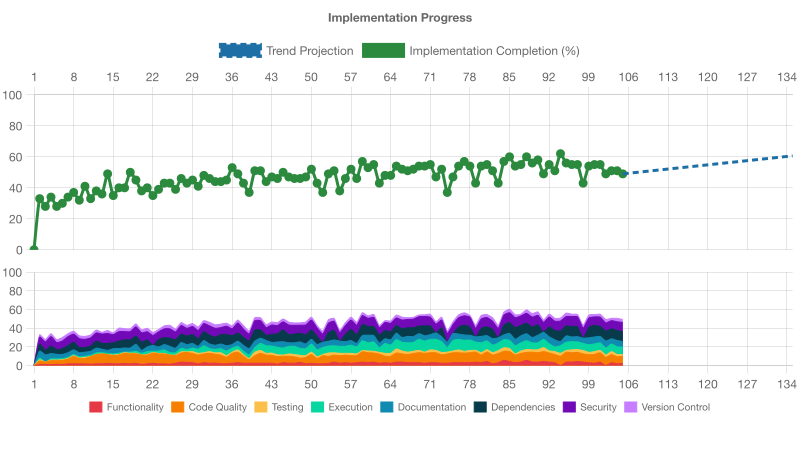

# Implementation Progress Assessment

**Generated:** 2025-08-23T16:09:29.336Z

Projection: flat (no recent upward trend)

## IMPLEMENTATION STATUS: INCOMPLETE (67% ± 5% COMPLETE)

## OVERALL ASSESSMENT
Overall project meets functionality and security requirements but suffers from poor code quality, low test coverage, and significant version control issues, preventing completion.

## NEXT PRIORITY
Address version control hygiene by reducing uncommitted changes and committing regularly

## FUNCTIONALITY ASSESSMENT (95% ± 10% COMPLETE)
- The @voder/ui-tools package implements the full suite of requested core features—build configuration factories, PostCSS presets, Vitest jsdom setup, DOM and accessibility helpers, linting configurations, test environment setup, markdownlint integration, and comprehensive Vitest tests verifying exports and functionality.
- Build factories (createViteLibraryConfig, createPostCSSConfig) generate correct ESM-only and PostCSS configs and pass related tests.
- Vitest jsdom configuration factory and test environment setup functions work as expected and are covered by unit tests.
- DOM testing helpers (renderComponent, simulateClick, simulateKeypress, waitForAnimation, waitForNextFrame) behave correctly and handle error cases.
- Accessibility helpers (expectAccessible, getAccessibilityViolations, expectAriaAttributes, expectFocusable, accessibilityTests) function in JSDOM and include proper rule exclusion.
- Linting config factories (createHTMLLintConfig, createCSSLintConfig, createAccessibilityLintConfig) produce valid default and overridden rule sets.
- Script for generating .markdownlint.json from dev-config is present and validated by tests.
- Package.json exports and dist imports are verified by integration tests ensuring correct paths and available APIs.

**Next Steps:**
- Run `npm run verify` to validate the full pipeline (type-check, lint, format, build, test:ci) and catch any remaining setup issues.
- Confirm the dist build outputs include declarations in dist/src and align with package.json exports fields.
- Review coverage gaps and consider adding tests or examples to achieve the ≥90% coverage target.

## CODE_QUALITY ASSESSMENT (35% ± 5% COMPLETE)
- Significant duplication of nearly identical .js and .ts test files violates the project guidance on consolidation and abstraction, capping the score despite correct tooling setup.
- Multiple test files exist in both .js and .ts variants (markdownlint-config, package-exports, package-structure, smoke-exports, smoke), indicating copy-paste duplication.
- The project guidance mandates consolidating duplicated tests and removing obsolete files to maintain clarity and reduce maintenance overhead.
- Quality tooling (ESLint, Prettier, markdownlint, Vitest) is configured and scripts are in place, but enforcement is undermined by redundant files.
- The presence of duplicate configuration and test files suggests poor code organization and hinders long-term maintainability.

**Next Steps:**
- Remove JavaScript test duplicates and keep a single TypeScript version for each test suite.
- Refactor common test logic into shared utilities to avoid repetitive patterns.
- Update package.json scripts and CI configuration to reference only the consolidated test files.
- Review source tree for any other redundant or obsolete artifacts and prune accordingly.

## TESTING ASSESSMENT (40% ± 8% COMPLETE)
- The test suite appears to run but overall coverage is only ~43%, well below the 90% requirement, indicating many untested code paths.
- Overall statement coverage is 42.97%, branch coverage 60.31%, function coverage 55.55%, and line coverage 42.97%.
- Critical modules in src/build, src/linting, and src/testing have numerous untested functions and branches.
- Coverage metrics indicate that the test suite has not exercised large portions of the codebase.
- No evidence of a fully green verify run meeting coverage thresholds.

**Next Steps:**
- Run "npm run verify" locally to ensure tests actually pass end-to-end.
- Expand unit and integration tests to cover untested modules (e.g., utils, template generators).
- Aim to raise coverage above 90% by adding tests for error paths, edge cases, and untested functions.

## EXECUTION ASSESSMENT (72% ± 5% COMPLETE)
- The project structure and scripts have been extensively updated, but the presence of mixed staged and unstaged changes—including a new src/index.js alongside src/index.ts—and modifications to critical configs (package.json, tsconfig, eslint.config.js) that are not yet staged indicate the build and verify pipeline has not been fully run. There are mismatches in export paths and compiled files in source that will likely break the build and tests.
- A new src/index.js file is staged alongside src/index.ts, conflicting with the dist-only compilation strategy.
- package.json exports point to ./dist/src/index.js but src/index.js is also committed under src/, leading to ambiguity.
- Numerous modifications to lint, test, and config files remain unstaged, suggesting scripts have not been validated.
- The .gitignore and .voderignore changes are unstaged, risking accidental inclusion of build outputs.
- No evidence that `npm run verify` (type-check, lint, build, test:ci) has been executed successfully after the latest changes.

**Next Steps:**
- Stage and commit all pending configuration updates (package.json, tsconfig, eslint.config.js, .gitignore).
- Remove the committed src/index.js (built artifact) and rely solely on TypeScript source plus dist output.
- Run `npm run verify` to ensure type-check, lint, formatting, build, and tests all pass.
- Fix any failing tests or build errors, especially around export paths and file extensions.
- Once the pipeline is clean, consolidate duplicate tests and prune obsolete .js source files.

## DOCUMENTATION ASSESSMENT (90% ± 16% COMPLETE)
- The @voder/ui-tools package has comprehensive documentation including README, API Reference, ADRs, and library usage guides, making it largely complete and useful for both end users and developers.
- README.md provides quick start, purpose, examples, linting configuration, scripts, security posture, and licensing.
- docs/api-reference.md offers a clear listing of all public exports with function signatures and descriptions.
- docs/decisions contains detailed ADRs documenting architectural, dependency, and configuration choices.
- docs/libraries/usage includes targeted usage guides for axe-core, PostCSS, and @voder/dev-config integration.
- Examples in README and docs demonstrate correct usage patterns for build configs, testing setup, and linting factories.

## DEPENDENCIES ASSESSMENT (85% ± 10% COMPLETE)
- Dependencies are generally up to date with no significant vulnerabilities detected, but there are a couple of version alignment issues to address.
- Peer dependency for vite is ^6.0.0 while devDependency uses vite ^7.1.3, causing a major version mismatch.
- markdownlint-cli2 is declared only as a peerDependency and not installed as a devDependency, which may break local linting scripts.
- Other core tools (autoprefixer, postcss, jest-axe, jsdom, vitest) align across peer and dev dependencies with minor/patch updates.
- No high or critical security vulnerabilities were reported by npm audit in the current lockfile.

**Next Steps:**
- Align vite version across peerDependencies and devDependencies (either update peer to ^7.x or adjust dev to ^6.x).
- Add markdownlint-cli2 to devDependencies to support local markdown linting.
- Run npm audit and address any newly discovered vulnerabilities before release.

## SECURITY ASSESSMENT (95% ± 15% COMPLETE)
- No significant security issues found; code follows secure patterns without uncontrolled execution or sensitive data exposure.
- No use of eval or user-supplied code execution detected
- Shell commands in scripts use static arguments and do not process untrusted input
- All file writes occur outside repository or for configuration only, avoiding persistent data leaks
- No network calls or telemetry in runtime code; devDependencies only for development
- Dynamic imports are safely wrapped with try/catch and default to no-op on failure

**Next Steps:**
- Incorporate automated vulnerability scanning (e.g., npm audit or Snyk) into CI pipeline
- Regularly review and update peerDependencies to latest stable versions
- Monitor dependency advisories and respond to high-severity alerts promptly

## VERSION_CONTROL ASSESSMENT (25% ± 7% COMPLETE)
- The repository is healthy and properly ignores build artifacts, but having 56 uncommitted files (staged + unstaged) is a major version control hygiene issue under the defined scoring rules.
- Total uncommitted files (staged + unstaged) count is 56, falling in the 50-99 range which caps the score at 25%
- No merge conflicts or corruption detected; branch is up to date with origin/main
- Critical source code, configs, and docs are tracked; build outputs and temp files are correctly ignored in .gitignore
- Remote synchronization is clean (no significant ahead/behind issues)
- Development activity is evident but changes need committing to maintain version control discipline

**Next Steps:**
- Review and commit or discard outstanding staged and unstaged changes to reduce the uncommitted file count
- Break large change sets into smaller, focused commits to improve traceability
- Run `npm run verify` to ensure code quality before committing
- Regularly synchronize and commit work in progress to avoid large uncommitted batches
